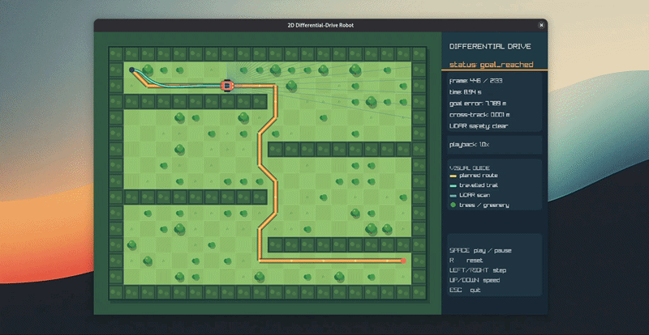

# Autonomous Differential-Drive Robot Simulator

<p align="center">
  A deterministic C++17 robotics simulator with planning, control, LiDAR, collision checking, and an interactive top-down viewer.
</p>

<p align="center">
  
</p>

<p align="center">
  <a href="https://github.com/mohaakash/Autonomous-Differential-Drive-Robot-Simulator/actions/workflows/ci.yml"></a>
  
  
</p>

## What’s inside

| Area | Implementation |
| --- | --- |
| Robot model | Differential-drive kinematics, exact constant-twist integration, wheel saturation |
| Planning | Deterministic 8-connected A* with footprint-aware collision clearance |
| Control | Bounded pure-pursuit path tracking with goal and cross-track metrics |
| Sensing | Configurable LiDAR ray casting, mount transforms, seeded noise, no-return flags |
| Safety | Collision validation, forward-sector monitoring, stop/replan contracts |
| Visualization | Optional raylib viewer with a car, garden-maze terrain, trees, route, trail, and LiDAR |
| Engineering | CMake presets, unit/integration tests, sanitizer checks, benchmark, and GitHub Actions CI |

The core simulator is headless and deterministic. The viewer is an optional presentation layer and does not control simulation time.

## Quick start

### Build and test the headless simulator

Requirements: CMake 3.21+, a C++17 compiler, and Make or another CMake-supported build tool.

```bash
cmake --preset debug
cmake --build --preset debug
ctest --preset debug --output-on-failure
```

### Run a reproducible scenario

```bash
./build/debug/robot_sim \
  --run maps/simple_room.map \
  --output results/simple_room_goal \
  --seed 42
```

The run writes a resolved configuration, JSON summary, planned-path CSV, fixed-step trace, LiDAR CSV, and SVG map overlay to `results/simple_room_goal/`.

## Interactive viewer

Build the optional raylib viewer and launch the garden-maze demo:

```bash
cmake --preset viewer
cmake --build --preset viewer
ctest --preset viewer --output-on-failure
./build/viewer/robot_sim_viewer
```

The viewer uses `maps/garden_maze.map` by default. Pass another marker-based map when needed:

```bash
./build/viewer/robot_sim_viewer maps/simple_room.map
```

| Key | Action |
| --- | --- |
| `Space` | Pause / resume |
| `R` | Reset playback |
| `Left` / `Right` | Step backward / forward while paused |
| `Up` / `Down` | Change playback speed |
| `Escape` | Quit |

If raylib is unavailable, the regular `debug` preset still builds and tests the headless simulator. See [`docs/interactive-viewer.md`](docs/interactive-viewer.md) for the full viewer contract.

## Quality gates

```bash
# Warnings as errors
cmake --preset ci
cmake --build --preset ci
ctest --preset ci --output-on-failure

# AddressSanitizer + UndefinedBehaviorSanitizer
cmake --preset asan-ubsan
cmake --build --preset asan-ubsan
ctest --preset asan-ubsan --output-on-failure

# Runtime benchmark
./build/ci/robot_sim_benchmark maps/simple_room.map 100
```

The benchmark is diagnostic only; its wall-clock values are not part of deterministic result comparisons.

## Documentation

The [documentation index](docs/README.md) links the requirements, architecture, kinematics, coordinate frames, map format, planning, control, LiDAR, experiments, testing strategy, viewer guide, and implementation roadmap.

## Repository layout

```text
include/robot_sim/  Public simulator headers
src/                Core, CLI, benchmark, and viewer sources
tests/              Unit, integration, and hardening tests
maps/               ASCII occupancy-grid demo maps
cmake/              Dependency and build helpers
docs/               Design contracts, verification, and viewer documentation
.github/workflows/  Continuous integration
```

## Project status

Phases 0–8 are implemented. The current scope is a software-only 2D simulator; ROS2 integration, localization experiments, controller comparisons, and video export remain optional extensions.
